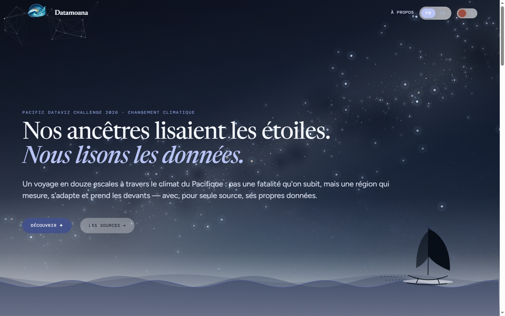
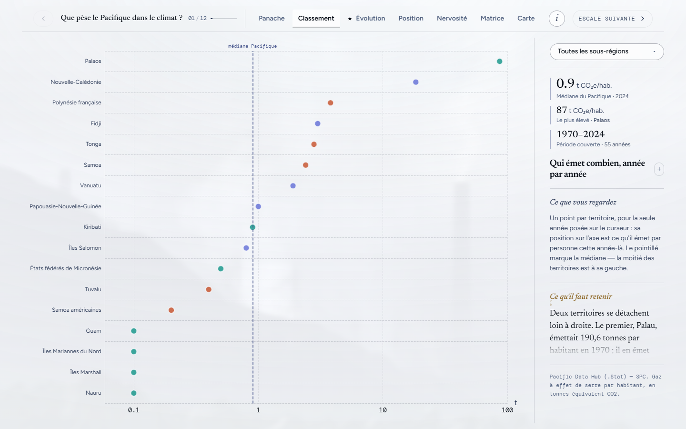
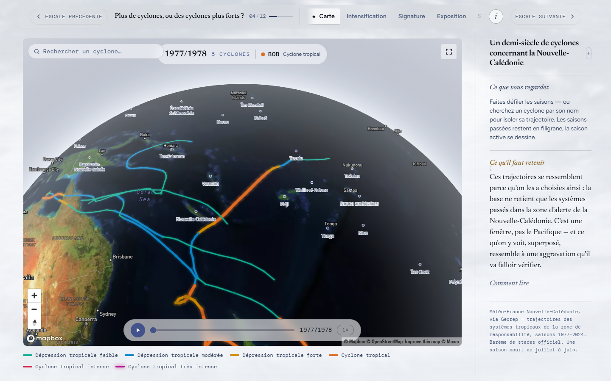
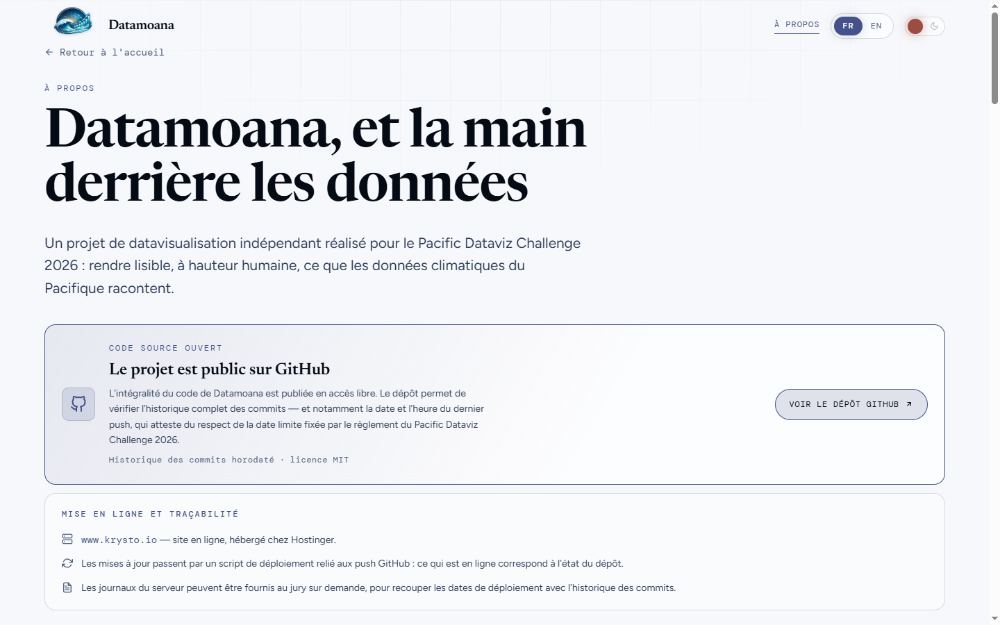
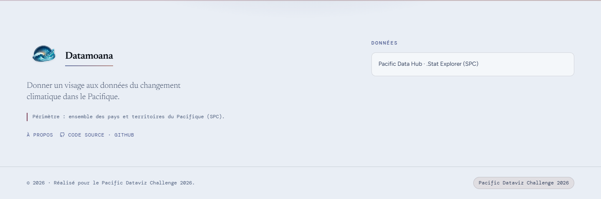

<div align="center">

# Pacific Dataviz Challenge 2026 — proposition « Datamoana »

**Une contribution au [Pacific Dataviz Challenge 2026](https://pacificdatavizchallenge.org/fr)**
Concours de datavisualisation organisé autour du **Pacific Data Hub** de la
**Communauté du Pacifique (SPC)**.
Thème 2026 : **le changement climatique dans le Pacifique**.
Catégorie : **Interactive Dataviz**.

[](https://pacificdatavizchallenge.org/fr)
[](https://pacificdatavizchallenge.org/fr)
[](https://stats.pacificdata.org/)
[](LICENSE)
[](#langues)
[](https://www.krysto.io)

**[▶ Voir l'application en ligne — www.krysto.io](https://www.krysto.io)**

</div>

<div align="center">
  
</div>

---

> **Le concours d'abord.** Ce dépôt n'existe que pour le Pacific Dataviz Challenge :
> le sujet, les données, les règles et le calendrier sont ceux du concours. *Datamoana*
> est simplement le nom donné à la proposition. Tout ce qui suit est écrit pour que le
> jury puisse **vérifier** plutôt que croire sur parole : sources, licence, horodatage
> des livraisons, et code intégralement lisible.

**English summary** — *Datamoana* is an interactive data-visualisation web app submitted
to the Pacific Dataviz Challenge 2026 (theme: climate change in the Pacific, Interactive
Dataviz category). Twelve chapters ("escales") tell one climate story about Pacific island
countries and territories, entirely from open data fetched live from the Pacific Data Hub
.Stat and other official sources. **No figure is hardcoded anywhere in this codebase.**
The interface is available in French and English. Source code is MIT-licensed. Live at
**[www.krysto.io](https://www.krysto.io)**. Issues and pull requests are welcome — see
[Contribuer](#contribuer).

---

## Sommaire

- [Ce que raconte l'application](#ce-que-raconte-lapplication)
- [Aperçu](#aperçu)
- [Le principe non négociable : aucun chiffre en dur](#le-principe-non-négociable--aucun-chiffre-en-dur)
- [Conformité au règlement](#conformité-au-règlement)
- [Mise en ligne et traçabilité](#mise-en-ligne-et-traçabilité)
- [Démarrage](#démarrage)
- [Variables d'environnement](#variables-denvironnement)
- [Proxies de données](#proxies-de-données)
- [Architecture](#architecture)
- [Conventions de datavisualisation](#conventions-de-datavisualisation)
- [Contribuer](#contribuer)
- [Licence](#licence)

---

## Ce que raconte l'application

Douze **escales**, dans un ordre narratif unique. Chacune pose une question à laquelle
**ses propres données peuvent répondre** — pas une de plus : aucune cause là où il n'y a
que des corrélations, aucun futur là où il n'y a que des séries passées.

| # | Escale | Route | Question posée |
|---|---|---|---|
| 01 | Émissions | `/emissions` | Que pèse le Pacifique dans le climat ? |
| 02 | Océan | `/ocean` | De combien l'océan s'est-il réchauffé ? |
| 03 | Ciel | `/ciel` | Le climat s'écarte-t-il de ses normales ? |
| 04 | Cyclones | `/cyclones` | Plus de cyclones, ou des cyclones plus forts ? |
| 05 | Agriculture | `/agriculture` | Nos terres produisent-elles plus, ou moins ? |
| 06 | Vivant | `/vivant` | Protège-t-on plus vite qu'on ne perd ? |
| 07 | Littoral | `/territory` | La mer monte-t-elle là où l'on vit ? |
| 08 | Eau & santé | `/sante` | L'eau potable protège-t-elle la santé ? |
| 09 | Catastrophes | `/impact` | Qui encaisse le choc des catastrophes ? |
| 10 | Énergie | `/momentum` | Jusqu'où va l'électricité renouvelable ? |
| 11 | Économie | `/economie` | L'économie paie-t-elle son empreinte ? |
| 12 | Synthèse | `/synthese` | Quelles marges de manœuvre reste-t-il ? |

Chaque escale s'ouvre sur une image et une question, puis bascule sur un tableau de bord :
plusieurs vues d'un même sujet, et une **colonne de lecture** qui accompagne le lecteur
non-initié dans cet ordre — *ce que vous regardez* → *ce qu'il faut retenir* →
*comment lire* → *à vous de jouer* → *source*.

<a id="langues"></a>
**Langues.** Interface intégralement **française et anglaise** (bascule FR/EN dans
l'en-tête), comme l'exige le règlement. La langue n'est pas devinée depuis le navigateur :
elle est **demandée** au lecteur avant le départ, en même temps que le thème clair/sombre.

## Aperçu

### Le tableau de bord d'une escale, et sa colonne de lecture



*Escale 01. Les émissions par habitant vont de 0,1 à 86,7 t CO₂e — un rapport de plus de
huit cents. En barres, quinze territoires sur dix-huit tombaient à un filet d'un pixel :
la vue passe donc en points sur **axe logarithmique**, la seule forme de marque qui
supporte cette étendue.*

### Un demi-siècle de trajectoires cycloniques



*Escale 04. 212 phénomènes tropicaux de l'archive mondiale IBTrACS (NOAA/NCEI), saison par
saison de 1977 à 2024, colorés par stade officiel. La carte est ici la démonstration, pas
un simple repère : c'est la seule escale où elle ouvre la navigation.*

### La page « À propos » — sources, méthode et dépôt



*Le lien vers ce dépôt et la chaîne de mise en ligne sont annoncés dès l'ouverture de la
page, avant même le sommaire.*



## Le principe non négociable : aucun chiffre en dur

**Toutes les valeurs affichées proviennent d'appels API au moment de l'exécution.**
Aucun nombre du récit n'est écrit dans le code. Quand une source est indisponible, la vue
affiche « données indisponibles » — **elle n'invente jamais une valeur de repli**, et ne
substitue jamais une estimation à une mesure.

Une seule exception, documentée dans l'application comme ici : le **trait de côte**
(Digital Earth Pacific — Landsat Coastlines, CC BY-NC 4.0), jeu géospatial trop volumineux
pour être appelé en direct, est fourni en extrait précalculé. Ses agrégats par territoire
(recul, avancée, dispersion) sont **approchés**, obtenus en rattachant chaque segment de
côte au territoire le plus proche ; l'application le dit à l'écran.

Le catalogue complet — **19 jeux de données**, dont **18 issus de la liste officielle du
concours** et 1 signalé « hors concours » (trajectoires cycloniques Météo-France
Nouvelle-Calédonie via Georep) — vit dans [`src/data/datasetCatalog.js`](src/data/datasetCatalog.js).
Chaque entrée porte le lien amont **et** le lien Pacific Data Hub .Stat du flux réellement
appelé. Il est consultable dans l'application sur `/a-propos` et `/data/:id`.

## Conformité au règlement

| Exigence du règlement | Réponse de ce projet | Où le vérifier |
|---|---|---|
| Au moins **un jeu de données de la liste officielle Pacific Data Hub** | 18 jeux officiels sur 19 | [`src/data/datasetCatalog.js`](src/data/datasetCatalog.js), `/a-propos` |
| Dataviz en **anglais ou français** | Interface complète FR **et** EN | [`src/i18n/`](src/i18n), bascule FR/EN dans l'en-tête |
| Entrée interactive soumise **comme une URL** qui reste en ligne | [www.krysto.io](https://www.krysto.io) | voir [Mise en ligne](#mise-en-ligne-et-traçabilité) |
| **Code source fourni** sous licence ouverte conforme à l'*Open Definition* | **MIT** | [`LICENSE`](LICENSE), ce dépôt public |
| Respect de la **date limite de dépôt** | Historique des commits horodaté, journaux serveur disponibles | voir ci-dessous |

## Mise en ligne et traçabilité

- **Site en ligne : [www.krysto.io](https://www.krysto.io)**, hébergé chez **Hostinger**.
- Les mises à jour passent par un **script de déploiement relié aux push GitHub** :
  ce qui est en ligne correspond à l'état de ce dépôt.
- **L'historique des commits de ce dépôt est public et horodaté** : la date et l'heure du
  dernier push y sont vérifiables directement, notamment au regard de la date limite fixée
  par le règlement.
- **Les journaux du serveur peuvent être fournis au jury sur simple demande**, afin de
  recouper les dates de déploiement avec l'historique des commits.

La même information est affichée dans l'application, en tête de la page `/a-propos`, pour
que le jury n'ait pas à chercher.

## Démarrage

Prérequis : **Node.js 18+** et npm.

```bash
git clone https://github.com/supportQC-NC/pacific_data_viz_2026.git
cd pacific_data_viz_2026

npm install
cp .env.example .env.local   # puis renseigner les variables (voir plus bas)

npm start                    # serveur de développement sur http://localhost:3000
npm run build                # bundle de production dans build/
```

`npm test` est câblé par Create React App mais **le projet ne contient aucun test** : la
vérification se fait dans le navigateur et par `npm run build`. **Le build de production
est le seul garde-fou de compilation** — le serveur de développement tolère des erreurs
qu'il refuse (une clé dupliquée dans un objet, par exemple).

## Variables d'environnement

| Variable | Rôle | Sans elle |
|---|---|---|
| `REACT_APP_MAPBOX_TOKEN` | Fonds de carte Mapbox GL (escales 02, 07, 04) | Les scènes carte se dégradent, l'application ne plante pas |
| `REACT_APP_PDH_BASE` | Surcharge la base SDMX Pacific Data Hub | Base publique par défaut |
| `REACT_APP_CYCLONE_FILE` / `..._POINTS_FILE` | Surcharge les GeoJSON cyclones | Fichiers de `public/data/cyclones/` |

`.env.local` n'est **jamais** versionné. `.env.example` ne doit contenir que des clés vides.

## Proxies de données

[`src/setupProxy.js`](src/setupProxy.js) relaie les API qui refusent l'appel direct depuis
`localhost` : Pacific Data Hub répond **403**, World Bank Data360 n'envoie **pas d'en-têtes
CORS**. **Ces proxies n'existent qu'en développement** (`npm start`).

Conséquence pour la mise en ligne : les services tentent l'appel **direct d'abord**, le
proxy seulement en secours — la version déployée fonctionne donc sans proxy. Si un
hébergeur en impose un, configurer le même reverse-proxy côté serveur (Nginx, fonction
serverless…) et pointer `REACT_APP_PDH_BASE` dessus. **Préserver cette chaîne de repli**
en modifiant un service.

## Architecture

```
src/
  App.js                     routes — 12 escales, 5 chapitres, /recit
  pages/                     25 pages (une par escale, une par chapitre, + transverses)
  components/                79 dossiers, dont charts/ (51 entrées)
    charts/echartsBase.js      fragments d'options ECharts + helpers de calcul
    charts/apexBase.js         équivalent ApexCharts (réexporte les mêmes helpers)
    charts/seriesColor.js      couleur de série attachée à l'entité, pas à la position
  services/                  10 clients API — un par domaine de données
  data/datasetCatalog.js     catalogue des jeux de données + liens amont
  store/context/             thème, langue, et journeyContext (ordre narratif)
  store/                     Redux Toolkit — ui, climate, territory
  i18n/                      fr.json, en.json + extraStrings.js (couche d'override)
  styles/_variables.scss     tous les tokens de couleur, d'espacement et de typo
  hooks/UseThemeTokens.js    lit les tokens CSS pour les graphiques canvas
public/data/                 GeoJSON statiques (cyclones, littoral)
docs/screenshots/            captures utilisées par ce README
scripts/                     scripts d'analyse et de contrôle i18n (Node, hors build)
```

Trois points à connaître **avant** toute modification :

- **[`store/context/journeyContext.js`](src/store/context/journeyContext.js) est la source
  de vérité de l'ordre narratif.** Les numéros d'escale se recalculent depuis `JOURNEY`.
  Les *identifiants* d'acte ne suivent pas l'ordre du récit (`a8` est l'escale 03) : ne
  jamais écrire un numéro en dur, utiliser `numberOf(id)` / `padOf(id)`.
- **Le thème passe par des variables CSS.** ECharts et ApexCharts ne savent pas résoudre
  `var()` : chaque graphique appelle `useThemeTokens()` et passe l'objet `tk` dans ses
  options, qui se relit via un `MutationObserver` sur `[data-theme]`. **Un hexadécimal
  écrit en dur dans un graphique est un bug** — il ne suivra pas le changement de thème.
- **`i18n/extraStrings.js` est une couche d'override** fusionnée par-dessus les deux JSON.
  Elle contient **un seul objet par langue** : une seconde clé de même nom dans le même
  littéral écrase silencieusement la première. Fusionner dans l'objet existant, ne jamais
  en ajouter un second.

`t('some.path')` renvoie le chemin lui-même quand la clé manque — un texte pointé visible à
l'écran signale donc une traduction manquante, pas un bug de rendu.

## Conventions de datavisualisation

Ce qui tient les douze escales ensemble tient en une règle : **un graphique doit déclarer
ce que sa couleur encode**, au lieu de choisir une rampe au cas par cas.

| Encodage | Pour quoi | Rampe | La légende dit |
|---|---|---|---|
| `magnitude` | grandeur sans jugement (population, arrivées, effectifs) | séquentielle lavande | « faible → élevé » |
| `stress` | grandeur orientée — **le foncé est toujours le pire** | ordinale lavande | « épargné → exposé » |
| `polarity` | vraie polarité autour d'un zéro qui a un sens | divergente **bleu ↔ ambre** | « sous ← 0 → au-dessus » |

Deux règles dures derrière ce tableau :

- **Jamais de vert ↔ rouge.** Mesuré à **ΔE 4,1** sous deutéranopie — les deux pôles sont
  la *même couleur* pour environ 8 % des hommes — alors qu'il mesure ΔE 33,9 en vision
  normale. C'est exactement pour cela qu'il survit partout : celui qui le choisit ne peut
  pas voir le problème. La divergente retenue est **bleu ↔ ambre**, pire cas CVD
  **ΔE 20,5**, chroma réduit de 24 % pour qu'elle ne se lise pas comme une alerte.
- **La polarité est une propriété de l'indicateur, pas du nombre.** Un accès à l'eau élevé
  est bon, une incidence de tuberculose élevée est mauvaise.
  [`services/syntheseApi.js`](src/services/syntheseApi.js) déclare déjà ce sens par
  indicateur (`dir: "up" | "down" | "abs"`) : le réutiliser, ne pas le re-déduire.

**Aucune rampe n'est invariante au thème.** Les trois sont déclarées dans les deux blocs de
`_variables.scss`. L'invariant à préserver : *le jeton 100/1 est la valeur la plus basse et
900/6 la plus haute, dans les deux thèmes* — sur fond sombre, le haut de gamme est donc le
jeton **clair**. Toute modification de palette se valide sur **les deux surfaces**.

Enfin, **la couleur d'une série suit l'entité, pas sa position** :
[`charts/seriesColor.js`](src/components/charts/seriesColor.js) assigne les couleurs depuis
un ordre canonique non filtré, si bien que changer le filtre de sous-région ne repeint
jamais les séries restantes. Au-delà de 8 séries, il bascule sur un encodage par
sous-région (3 teintes — le plafond validé pour toutes les paires). Ne jamais indexer une
palette par la position dans un tableau filtré, ni faire `i % palette.length`.

## Contribuer

**Les issues et les pull requests sont les bienvenues** — corrections de données, de
traductions, d'accessibilité, de rendu sur un navigateur ou une taille d'écran donnés,
comme améliorations de code.

1. Ouvrez une **issue** décrivant le problème ou la proposition (une capture et l'URL de la
   vue concernée aident beaucoup).
2. Forkez, créez une branche (`fix/…`, `feat/…`).
3. Vérifiez que **`npm run build` passe** avant de proposer la PR — c'est le seul contrôle
   automatique du projet.
4. Ouvrez la pull request en décrivant ce que vous avez vérifié à l'écran, et sur quelles
   largeurs.

Quelques attentes qui font gagner du temps à tout le monde :

- **Ne jamais coder une valeur de données en dur**, même « juste pour faire rendre un
  graphique ». C'est le principe fondateur du projet.
- **Pas d'hexadécimal en dur** dans un graphique ni dans une feuille de style : utiliser
  les jetons de `styles/_variables.scss` (et `tk` côté canvas), sans quoi le thème casse.
- **Pas de numéro d'escale en dur** : passer par `numberOf(id)` / `padOf(id)`.
- **Toute chaîne visible passe par `t()`** et existe en français **et** en anglais.
- Modifications ciblées et progressives, dans les conventions du fichier que vous touchez.

> **Note pendant la période de jugement.** Tant que le Pacific Dataviz Challenge 2026 est en
> cours d'évaluation, les contributions extérieures sont accueillies et discutées, mais leur
> fusion peut être différée après la clôture : l'entrée soumise doit rester le travail de son
> auteur, et l'historique du dépôt doit rester lisible pour le jury.

## Stack

React 19 · React Router 7 · Redux Toolkit · Sass · ECharts 6 · ApexCharts 4 · D3 7 ·
Mapbox GL 3 · GSAP — sur Create React App 5.

## Licence

**Code source sous licence [MIT](LICENSE)** — licence ouverte conforme à l'*Open Definition*,
comme l'exige le règlement du Challenge.

**Les données restent sous la licence de leurs producteurs.** Le détail source par source —
origine amont et lien Pacific Data Hub .Stat du flux réellement appelé — est dans
[`src/data/datasetCatalog.js`](src/data/datasetCatalog.js) et s'affiche dans l'application
sur `/a-propos`.

Le trait de côte provient de **Digital Earth Pacific — Landsat Coastlines**, sous
**CC BY-NC 4.0**, et n'est redistribué ici qu'en extrait, à des fins de visualisation.

---

<div align="center">

Réalisé pour le **[Pacific Dataviz Challenge 2026](https://pacificdatavizchallenge.org/fr)** ·
Données **[Pacific Data Hub .Stat](https://stats.pacificdata.org/)** — Communauté du Pacifique (SPC)

</div>
